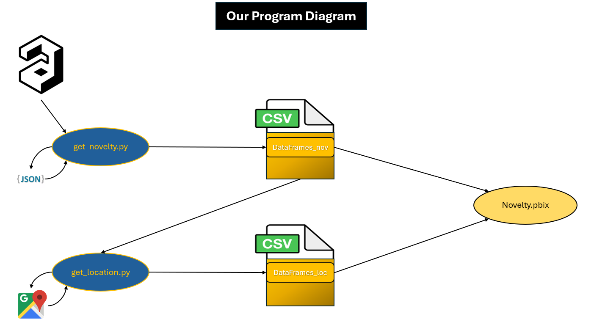

# Novelty-components-of-scientific-productions-for-each-SDG

As part of our Master’s program in Data Science for Economics and Business, we aim to enhance our skills in data visualization by developing a Power BI dashboard. This dashboard will showcase various components of the novelty of scientific productions using data from the [OpenAlex database](https://openalex.org/).

We begin with a sample of 800 most-cited articles for each Sustainable Development Goal (SDG), based on query keywords associated with the 17 SDGs, covering the period from 2016 to 2024. Novelty is calculated using methods for assessing rarity (Commonness) developed by Lee et al. (2015) (`get_novelty.py`). Additionally, we plan to process spatial data to uncover information about local novelties and clusters (`get_location.py`).

# Our tree
```
│   get_location.py
│   get_novelty.py
│   Novelty.pbix
│   README.md
│   requirements.txt
│   main.py
│
├───DataFrames_loc
│       DF_Climate Action.csv
│       DF_Gender Equality.csv
│       DF_Life on Land.csv
│       DF_No Poverty.csv
│       DF_Partnerships for the Goals.csv
│       DF_Quality Education.csv
│       DF_Reduced Inequality.csv
│       DF_Responsible Consumption and Production.csv
│       DF_SDG 14.csv
│       DF_SDG 16.csv
│       DF_SDG 3.csv
│       DF_SDG 6.csv
│       DF_SDG 7.csv
│       DF_SDG 8.csv
│       DF_SDG 9.csv
│       DF_Sustainable Cities and Communities.csv
│       DF_Zero Hunger.csv
│
├───DataFrames_nov
│       DF_Climate Action.csv
│       DF_Gender Equality.csv
│       DF_Life on Land.csv
│       DF_No Poverty.csv
│       DF_Partnerships for the Goals.csv
│       DF_Quality Education.csv
│       DF_Reduced Inequality.csv
│       DF_Responsible Consumption and Production.csv
│       DF_SDG 14.csv
│       DF_SDG 16.csv
│       DF_SDG 3.csv
│       DF_SDG 6.csv
│       DF_SDG 7.csv
│       DF_SDG 8.csv
│       DF_SDG 9.csv
│       DF_Sustainable Cities and Communities.csv
│       DF_Zero Hunger.csv
│
└───Presentation
        NoveltySchema.png
        Novelty_VBarthel_ABusché_DFracassi.pdf
```

# Our Diagram




# get_novelty.py

This script is designed to retrieve, process, and analyze scientific publication data from the OpenAlex API, focusing on top-cited works and their associated metadata. It facilitates the analysis of collaboration networks and novelty indicators while saving results in structured formats for further research.

## Main Purpose

The script processes publication data to:

1. Retrieve the most cited works based on specific queries.
2. Extract and organize metadata such as authors, institutions, citations, and research fields.
3. Calculate and validate novelty indicators using co-occurrence analysis and the Lee et al. (2015) methodology.
4. Save structured results for detailed analysis, including collaboration patterns and novelty trends.

## Key Features

### Data Retrieval
- Queries the OpenAlex API to fetch top-cited publications using customizable search terms.
- Supports filtering by publication date range (2016–2024) and sorting by citation count.

### Data Preparation
- Extracts key metadata:
  - Authors and their affiliated institutions.
  - Citation counts and referenced works.
  - Research fields, publication type, and Sustainable Development Goals (SDGs).
- Handles missing or incomplete data gracefully.
- Generates unique IDs for publications and referenced works using hashing.

### Novelty and Collaboration Analysis
- Computes co-occurrence matrices for referenced works.
- Applies the Lee et al. (2015) indicator to assess research novelty.
- Supports weighted and time-windowed analysis of reference networks.

### Data Validation
- Ensures referenced works exist within the dataset.
- Identifies and logs potential inconsistencies in references.

### Data Storage and Visualization
- Organizes and saves processed data by publication year in JSON format.
- Converts processed data into pandas DataFrames for detailed statistical analysis.
- Saves results, including novelty scores, to `.csv` files.
- Provides descriptive statistics and summary reports.

### Automation and Cleanup
- Processes multiple queries iteratively, handling each independently.
- Cleans up temporary directories and files after processing.

# get_location.py

`get_location.py` is a Python script designed to process scientific publication data and determine the geographic location of institutions associated with each author. Using the Google Maps Geocoding API, the script extracts detailed location information, such as city, region, state, latitude, and longitude, for every institution listed in the dataset.

## Main Purpose

This script processes 17 `.csv` files, which are derived from `/DataFrames_nov`, containing metadata about publications, including authors and their institutions. For each institution, it identifies its geographic location and enriches the dataset with detailed positional information, making it easier to analyze the geographic distribution of scientific collaborations.

The enriched datasets are then saved as 17 output `.csv` files, which are stored in the `/DataFrames_loc` directory.

## Key Features

- Extracts geographic details (city, region, state, latitude, longitude) for each institution using the Google Maps Geocoding API.
- Associates each author with their respective institution in a row-wise format.
- Adds missing geographic details by validating latitude and longitude data.
- Determines the continent of each institution's country for additional context.
- Saves enriched data to `.csv` files for further analysis or visualization.

This script is particularly useful for researchers and analysts seeking to map the institutional affiliations of authors in scientific datasets and analyze the geographic distribution of their research outputs.

# PBI.pbix:

This dashboard allows you to explore the novelty indicators for scientific productions on the 17 SDGs since 2016. It consists of 5 pages providing a complete analysis of the current and past situation.

- ‘Summary’ is a page that provides information about a number of SDGs. We can see the number of citations, publications and novelty indicator since 2016 for each author, area of expertise, type of production and the evolution by year.

- ‘Year View’ provides a year-by-year analysis of each SDG. We can see changes in key indicators compared with the previous year, as well as the most active SDGs by type and institution.

- ‘Mapping’ gives you a geographical view of the scientific output situation.

- ‘SDG Comparison’ allows you to compare the key indicators for different SDGs. We offer a view by year, by region and analyse the differences in the link between the number of contributors and the novelty indicator.

- ‘Database’ is a page that allows the user to check the data by being able to sort it.

# Development Environment:
Requirements:
Python 3.8+

We are using a lightweight version of the **Novelpy** package developed by Kevin Wirtz and Pierre Pelletier (see [GitHub](https://github.com/Kwirtz/novelpy), [Documentation](https://novelpy.readthedocs.io/en/latest/)), which can cause conflicts between packages.

Clone this repository on your local machine :
```
git clone https://github.com/valentinb67/Novelty-components-of-scientific-productions
```

**Navigate to the project directory and install the dependencies :**
```
cd Novelty-components-of-scientific-productions
pip install -r requirements.txt
```
To run the application use:
```
python main.py
```
